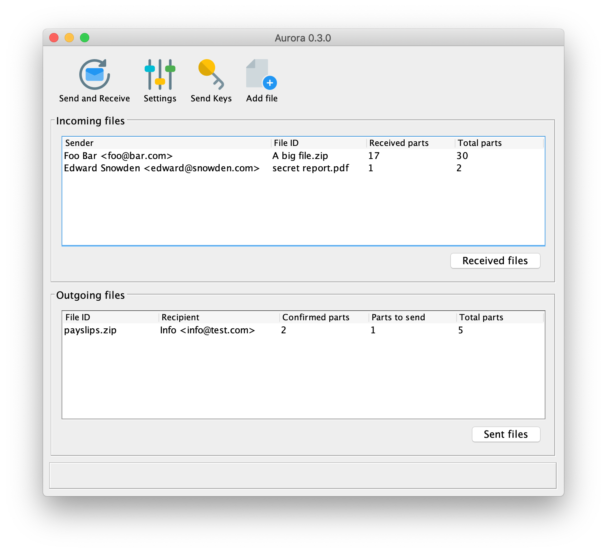

# Aurora

A simple software to send and receive big files in chunks using IMAP, SMTP and asymmetrical encryption.

Refactoring of some old code that I wrote for my bachelor's thesis, now using [libsaltpack-jni](https://github.com/gherynos/libsaltpack-jni).

Icons made by [Pixel perfect](https://www.flaticon.com/authors/pixel-perfect) from [www.flaticon.com](http://www.flaticon.com/).

## Author

> GitHub [@gherynos](https://github.com/gherynos)

## License

Aurora is licensed under the [GNU General Public License v3.0](https://www.gnu.org/licenses/gpl-3.0.en.html).
